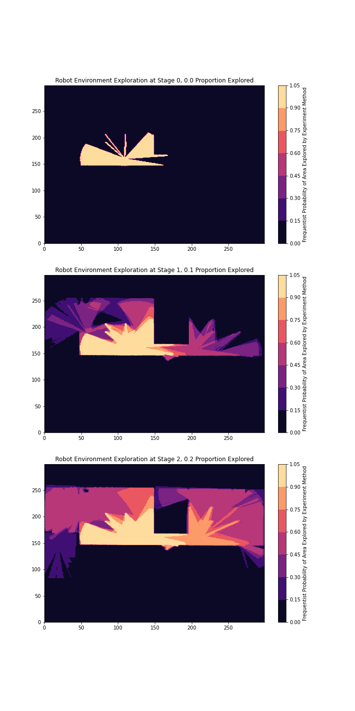

# Description 
**Heatmap Analysis of Robot Exploration (HARE)** is a debugging, visualization, and optimization tool for occupancy-grid based robot exploration built for UC Berkeley's Mechanical Systems Control (MSC) Lab. HARE is structured as a ROS package and nodes combined with Jupyter Notebook visualization tools and is designed to be easily integrated into your robot exploration research workflow. 

Provided a ROS topic containing an OccupancyGrid that a given robot exploration experiment updates continuously, HARE takes snapshots of the OccupancyGrid at user-defined stages exploration and logs them to ```logs/heatmaps``` under the experiment's name. These snapshots of progress are aggregated across trials of the same experiment methodology to form heatmaps and visualizations viewable through the Jupyter Notebook ```scripts/analyzer.ipynb```. 

# Examples


# Usage 
## Overview
1. Clone HARE to your catkin workspace's ```src``` directory. 
2. Install all [dependencies](#Dependencies).
3. Build the package. 
4. Edit ```configuration/exploration_progress_config.json``` to name your experiment, define the stages where snapshots are taken, scale your OccupancyGrid, set the map topic, and more. The configuration options are described in detail [here](#Details)
5. Begin running your existing robot exploration experiment, then start the ```src/exploration_progress.py``` ROS node through adding it to an existing launch file or manually ```rosrun```.
6. When ```src/exploration_progress.py``` and/or your experiment finishes, open ```scripts/analyzer.ipynb``` through Jupyter Notebook and select your experiment to analyze. 

## Detailed
### Configuration JSON Schema
Experiment snapshots are highly configurable in when they occur and bounds can be set on the particular occupancy grid to scale borders that are not desired for exploration such as thicker outside walls or outside areas of the simulated/physical environment. Below is the JSON schema: 
```
{
    "experiment_name": "",
    "units": "",
    "stages": [],
    "map_bounds_x": [],
    "map_bounds_y": []
}
```

```"experiment_name"``` must be a string that is a valid UNIX directory name. It will be the parent directory containing logs associated with a particular experiment. Logs may become polluted in aggregate if you reuse the same name without removing prior logs. 

```"unit"``` must be a string of value either ```"second"``` or ```"proportion"```. 

- If ```"unit"``` has value ```"second"```, ```"stages"``` must be a list of unique numbers that denotes the amount of seconds passed since the node started and presumably approximating since the robot began exploring the environment. At every second listed in ```"stages"```, the exploration progress node will write a snapshot of the occupancy grid to a log file for further analysis. 
- If ```"unit"``` has value ```"proportion"```, ```"stages"``` must be a list of unique numbers that lie in the [unit interval](https://en.wikipedia.org/wiki/Unit_interval) that denotes the proportion of the environment the robot will have explored for a snapshot to take place. and presumably approximating since the robot began exploring the environment. At every proportion listed in ```"stages"```, the exploration progress node will write a snapshot of the occupancy grid to a log file for further analysis. 

```"map_bounds_x"``` can be an empty list or a list of length 2 containing integer values that delineate the x borders of the occupancy grid that are relevant to your experiment. If the value is empty, the whole occupancy grid will be written to the log files for analysis. 

```"map_bounds_y"``` can be an empty list or a list of length 2 containing integer values that delineate the y borders of the occupancy grid that are relevant to your experiment. If the value is empty, the whole occupancy grid will be written to the log files for analysis. 

### Launch File Usage


# Dependencies 
Jupyter Notebook analysis must be done in Python3, while this package is designed for ROS Kinetic which uses Python2. 

## analyzer.ipynb
Install [Anaconda](https://www.anaconda.com/) and start a Python3 conda environment. Run the following command to install Python3 dependencies to the conda environment: ```conda install --file requirements.txt```. Do not touch your Python2 installation.

## exploration_progress.py
Install [ROS1](http://wiki.ros.org/) for your appropriate Ubuntu version. 